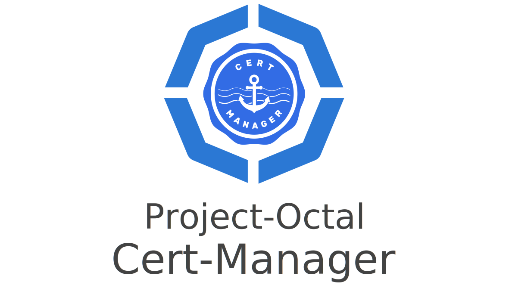

---

Simplifies the deployment and management of Jetstacks cert-manager on a Kubernetes cluster.

### TODO:
- Update the Terraform version to 1.0+
- Deprecate the `k8s` provider in favor of the `kubernetes_manifest` resource in the `kubernetes` provider.
- Add support for the latest version of Cert Manager. 

### Example
```hcl-terraform
module "cert_manager" {
  source = "github.com/project-octal/terraform-kubernetes-cert-manager"

  certificate_issuers = {
    letsencrypt = {
      name              = "letsencrypt-prod"
      server            = "https://acme-v02.api.letsencrypt.org/directory"
      email             = "dylanturn@gmail.com"
      secret_base64_key = var.letsencrypt_secret_base64_key
      default_issuer : true,
      ingress_class = module.traefik.ingress_class
    }
  }
}
```

<!-- BEGIN_TF_DOCS -->
## Requirements

| Name | Version |
|------|---------|
| <a name="requirement_terraform"></a> [terraform](#requirement\_terraform) | >= 0.13 |
| <a name="requirement_k8s"></a> [k8s](#requirement\_k8s) | 0.8.0 |

## Providers

| Name | Version |
|------|---------|
| <a name="provider_kubernetes"></a> [kubernetes](#provider\_kubernetes) | n/a |
| <a name="provider_random"></a> [random](#provider\_random) | n/a |

## Modules

| Name | Source | Version |
|------|--------|---------|
| <a name="module_cert_manager"></a> [cert\_manager](#module\_cert\_manager) | ./cert-manager | n/a |
| <a name="module_cert_manager_cainjector"></a> [cert\_manager\_cainjector](#module\_cert\_manager\_cainjector) | ./cert-manager-cainjector | n/a |
| <a name="module_cert_manager_issuers"></a> [cert\_manager\_issuers](#module\_cert\_manager\_issuers) | ./cert-manager-issuers | n/a |
| <a name="module_cert_manager_webhook"></a> [cert\_manager\_webhook](#module\_cert\_manager\_webhook) | ./cert-manager-webhook | n/a |
| <a name="module_custom_resource_definitions"></a> [custom\_resource\_definitions](#module\_custom\_resource\_definitions) | ./custom-resource-definitions | n/a |

## Resources

| Name | Type |
|------|------|
| [kubernetes_namespace.namespace](https://registry.terraform.io/providers/hashicorp/kubernetes/latest/docs/resources/namespace) | resource |
| [random_pet.instance_name](https://registry.terraform.io/providers/hashicorp/random/latest/docs/resources/pet) | resource |

## Inputs

| Name | Description | Type | Default | Required |
|------|-------------|------|---------|:--------:|
| <a name="input_certificate_issuers"></a> [certificate\_issuers](#input\_certificate\_issuers) | An object that contains the configuration for all the enabled certificate issuers. | <pre>object({<br>    letsencrypt = object({<br>      name : string,<br>      server : string,<br>      email : string,<br>      secret_base64_key : string,<br>      default_issuer : bool,<br>      ingress_class : string<br>    })<br>    # TODO: Add support for another one so this doesnt look so silly<br>  })</pre> | <pre>{<br>  "letsencrypt": null<br>}</pre> | no |
| <a name="input_image_pull_policy"></a> [image\_pull\_policy](#input\_image\_pull\_policy) | Determines when the image should be pulled prior to starting the container. `Always`: Always pull the image. \| `IfNotPresent`: Only pull the image if it does not already exist on the node. \| `Never`: Never pull the image | `string` | `"Always"` | no |
| <a name="input_image_repository"></a> [image\_repository](#input\_image\_repository) | The image repository to use when pulling images | `string` | `null` | no |
| <a name="input_labels"></a> [labels](#input\_labels) | (optional) A map that consists of any additional labels that should be included with resources created by this module. | `map(string)` | `{}` | no |
| <a name="input_namespace"></a> [namespace](#input\_namespace) | The namespace that Cert-Manager will reside in. | `string` | `"cert-manager"` | no |
| <a name="input_namespace_annotations"></a> [namespace\_annotations](#input\_namespace\_annotations) | Additional namespace annotations. | `map(string)` | `{}` | no |

## Outputs

| Name | Description |
|------|-------------|
| <a name="output_cert_issuer"></a> [cert\_issuer](#output\_cert\_issuer) | n/a |
<!-- END_TF_DOCS -->